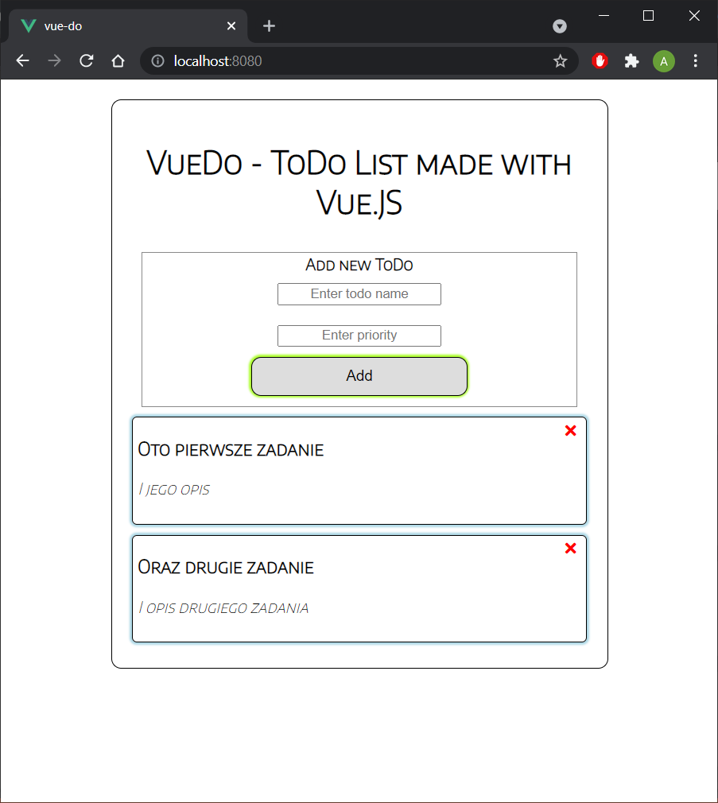

<h1 align="center">
 <strong>VueDo</strong>
   
</h1>

## Table of contents
* [Introduction](#introduction)
* [Features](#features)
* [Screenshots](#screenshots)
* [Technologies](#technologies)
* [License](#license)

## Introduction
VueDo is a very simple web application, which allows user to add and delete ToDo tasks.
Created just for learning Vue.JS puropse. There is no database or even JSON,
so todos will disappear after refresh.

## Features
* Add ToDo
* Delete ToDo

## Screenshots

   

## Technologies
* HTML, CSS
* Vue.JS

Application tested on Windows 10, Chrome 91.0.4472

## License
GNU General Public License v3.0
